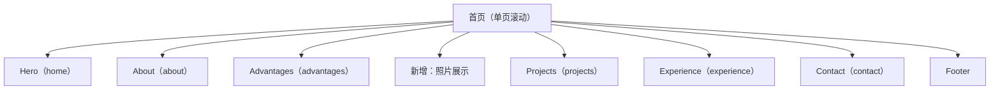

## 1. Product Overview
将你的个人网站从深色风格整体改为“浅色系极简风”，在不改变现有文案与内容结构的前提下，新增一个可展示照片的首页版块。
目标：提升专业感与阅读舒适度，同时为摄影/形象内容提供承载位。

## 2. Core Features

### 2.1 Feature Module
本次改版需求由以下页面组成：
1. **首页（单页滚动）**：全站浅色极简视觉规范、现有各内容区块保持不变、新增照片展示版块。

### 2.2 Page Details
| Page Name | Module Name | Feature description |
|-----------|-------------|---------------------|
| 首页（单页滚动） | 全站视觉风格改版 | 统一替换为浅色系极简风：白/浅灰背景、深色正文、弱化装饰线条与阴影、强调留白与信息层级；保持现有信息架构与文案不变（标题、段落、列表、项目内容、经历内容、联系方式等）。 |
| 首页（单页滚动） | 导航与滚动定位（现有） | 保持现有顶部导航与滚动高亮逻辑不变；保持原有锚点区块（home/about/advantages/projects/experience/contact）不变。 |
| 首页（单页滚动） | Hero（现有） | 保持头像/姓名/主标题/CTA（查看项目、联系我）与文案不变；仅调整布局细节以适配浅色极简风（间距、字重、按钮样式、背景装饰）。 |
| 首页（单页滚动） | About（现有） | 保持自我介绍文案与排版结构不变；仅替换配色与卡片/分隔视觉。 |
| 首页（单页滚动） | Advantages（现有） | 保持优势要点与技能呈现结构不变；仅调整为浅色极简样式（进度条、卡片、图标色）。 |
| 首页（单页滚动） | Projects（现有） | 保持项目列表、标签、奖项展示与跳转行为不变；仅调整为浅色极简卡片/列表样式。 |
| 首页（单页滚动） | Experience（现有） | 保持时间线/经历内容结构不变；仅调整线条、节点、标题层级与留白。 |
| 首页（单页滚动） | Contact（现有） | 保持邮箱/微信等联系方式与交互不变（如 mailto）；仅调整表述层级、按钮/链接样式。 |
| 首页（单页滚动） | Footer（现有） | 保持页脚信息不变；仅调整浅色系背景与分隔。 |
| 首页（单页滚动） | 新增：照片展示版块 | 在首页新增“照片展示”区块，用于放置你的照片/摄影作品：支持展示 3–12 张图片（本地资源或外链均可）；支持可选标题/一句话说明（默认可不加，避免改动现有文案）；点击可在新窗口打开原图或放大预览（二选一，以现有实现成本为准）。 |

## 3. Core Process
**访客浏览流程（单页）**
1. 进入首页后查看 Hero 信息与 CTA。
2. 通过顶部导航或滚动依次浏览 About、Advantages、Projects、Experience、Contact（现有顺序保持）。
3. 在新增的“照片展示”区块浏览你的照片；如提供放大/原图打开，则可点击查看。
4. 在 Contact 区块通过邮箱/社交方式与你取得联系。

