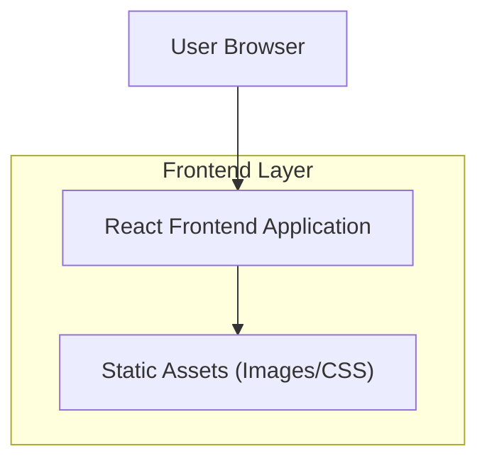

## 1.Architecture design

## 2.Technology Description
- Frontend: React@19 + TypeScript + vite@6 + tailwindcss@4 + motion + lucide-react
- Backend: None（静态站）

## 3.Route definitions
| Route | Purpose |
|-------|---------|
| / | 单页首页：Hero/About/Advantages/Projects/Experience/Contact + 新增照片展示版块 |

## 4.API definitions (If it includes backend services)
无（本次改版不新增后端与 API）。

## 6.Data model(if applicable)
无（本次改版不引入数据库）。

补充实现约束（用于开发落地对齐）
- **保持结构不变**：现有区块 id（home/about/advantages/projects/experience/contact）与滚动高亮逻辑保持不改。
- **新增照片版块数据来源**：优先使用本地静态图片（assets/ 或 public/），通过一个简单的 photos 列表配置驱动渲染；不引入 CMS。
- **主题切换范围**：仅做“默认浅色主题”改造，不做深浅主题切换开关（除非你后续明确提出）。
